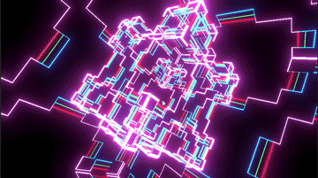
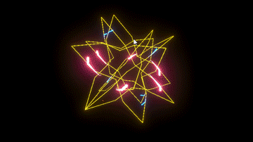

# Koch Fractals
Koch Fractals Demo for Unity 

## Koch Line

Rendering koch lines with LineRenderer, linear interpolation betweeb two last line generations, optionaly changing the interpolation ratio by analyzing the audio spectrum. 

## Koch Trail 

Move objects with trails by koch line path. 

